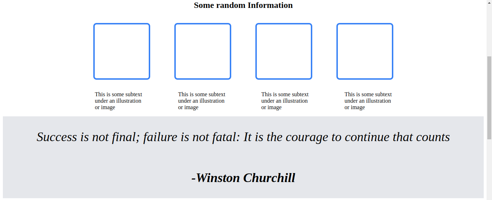

# Landing Page - Odin Project 2

## Introduction

After a thorough learning on the basics of HTML and CSS, I get to make a landing page especially using the concepts learned in CSS, most especially Flex Box. I will take one section at a time. I will write the HTML first then style the dofferent sections accordingly.

Learning the Box Model and FlexBox were probably the toughest things in Foundations of both HTML and CSS.

I have majorly used containers, i.e divs to style the content using FlexBox.

## Head

On the header of my project I made containers for both the logo and links and also for the content tha goes down below those two.

This is a snippet of the HTML I used for the same.

```

 <div class="top-header">
                <h5 class="head">Header Logo</h5>
                <ul class="list">
                   <li class="li"><a href="#">header link one</a></li>
                   <li class="li"><a href="#">header link two</a></li>
                   <li class="li"><a href="#">header link three</a></li>
                 </ul>
            </div> 
```


A lot of it is just containers and on the styling sheet I used flexbox to move and center things around.

## Mid Section

The mid section is what consumed a lot of time compared to the other parts of the page.

I figured out a couple of things such as colouring the outline of a box using the `outline` property in CSS. This part was also where the centering of a div joke happened. I saw how Flex Box just makes life easier and I am ready to discover more of these magic tricks.



Those blue boxes taught me some new things on CSS and also centering things on a page using Flex Box. For centering, I used;

```

.card-text {
    display: flex;
    flex-direction: row;
    justify-content: center;
}
``` 
and _voila_. Some adrenaline rush on that one. The mid section also had a container for taking action and a button to be clicked.

## Footer

The footer was not a had nut to crack. I just had to style the fonts, adding color and a logo for the copyright.

That marks the end of that short project.